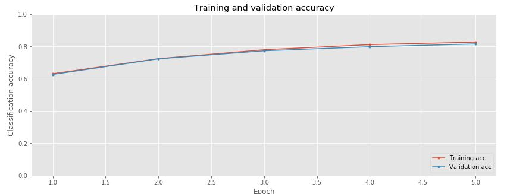

# TensorFlow Sequence Modeling
- In this project, I explored sequence modeling using Recurrent Neural Networks (RNNs), LSTMs, and GRUs in TensorFlow.
- You can get the code in [tensorflow_sequence_modeling.ipynb](./tensorflow_sequence_modeling.ipynb)

## Sequence Models
- I built and trained sequence models using TensorFlow's RNN, LSTM, and GRU layers for time-series prediction tasks.

### Accuracy Plot:
- The model's accuracy over the training epochs was visualized.

- A plot showing how accuracy improves over time during training.

## Setup
- Create virtual environment: `python -m venv venv`
- Activate virtual environment: `call venv/Scripts/activate.bat` in cmd
- Install dependencies: `pip install -r requirements.txt`

# Libraries
- TensorFlow
- Numpy
- Matplotlib

## Contact
- LinkedIn: [Natan Asrat](https://linkedin.com/in/natan-asrat)
- Gmail: nathanyilmaasrat@gmail.com
- Telegram: [Natan Asrat](https://t.me/fail_your_way_to_success)
- Youtube: [Natville](https://www.youtube.com/@natvilletutor)
